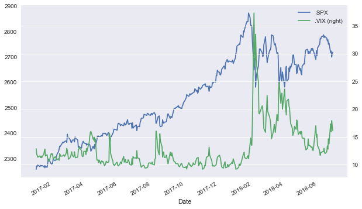
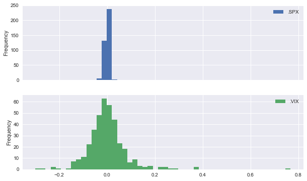

# `mvportfolio`

`mvportfolio` is a simplistic Python package to analyze and manage investment portfolios according to the Mean-Variance Portfolio (MVP) theory.

<br>

 

## Installation

### From Source 

Open a terminal and execute

    git clone http://github.com/yhilpisch/mvportfolio
    cd mvportfolio
    python setup.py install

### Via `pip`

Open a terminal and execute

    pip install --index-url https://test.pypi.org/simple/ mvportfolio

## First Steps

Some imports first.


```python
from pylab import plt
import mvportfolio as mvp
```


```python
plt.style.use('seaborn')
%matplotlib inline
```

Second, an **instance** of the main class `MVPPortfolio`.


```python
p = mvp.MVPPortfolio(['.SPX', '.VIX'], '2017-1-1', '2018-6-30')
```

Third, some **statistics** for the equal weights portfolio.


```python
p.weights
```


    [0.5, 0.5]


```python
p.portfolio_return()
```


    0.13792208996374847


```python
p.portfolio_volatility()
```


    0.6462235282900843


Fourth, the **minimum risk portfolio weights**.


```python
opt = p.minimum_risk_portfolio()
```


```python
opt['x']
```


    array([0.93891629, 0.06108371])


Fifth, **visualization** of the data.


```python
p.data.plot(figsize=(10, 6), secondary_y='.VIX');
```





```python
p.returns.plot.hist(figsize=(10, 6), bins=50, subplots=True);
```





## Copyright & License

&copy; The Python Quants GmbH | MIT License.
